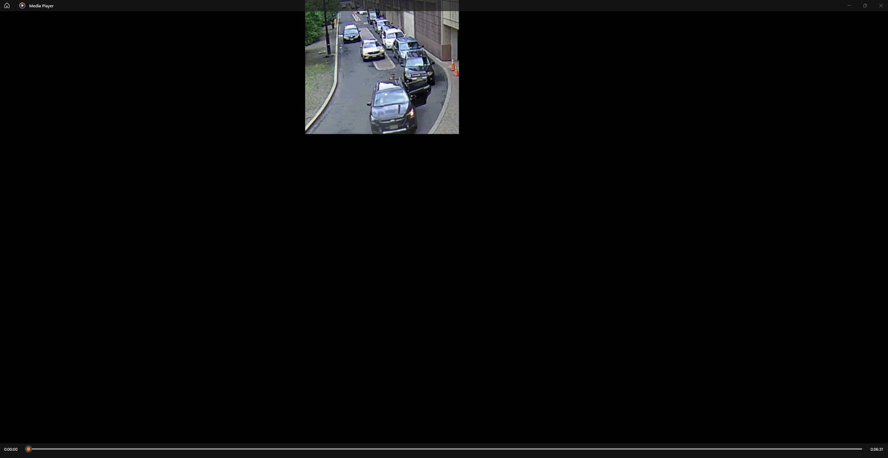
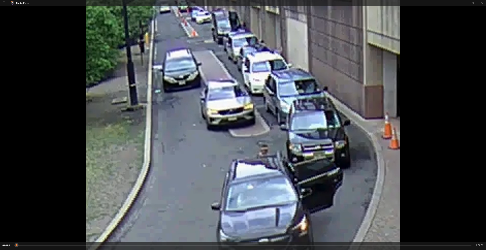

# 🎬 Video Crop & Upscale with FFmpeg

A simple PowerShell-based tool for automatically detecting and cropping black borders from videos, then upscaling the actual picture area to a desired resolution — all using FFmpeg.

---

## ✨ Features

- Automatically detects crop parameters (no guesswork needed).
- Crops out black borders or unused areas.
- Upscales video to a target resolution (default: 1280×1080).
- Maintains original audio without re-encoding.
- Works on any FFmpeg-supported video format.

---

## 📂 Project Structure

```
video-crop-upscale-ffmpeg/
│── scripts/           # PowerShell automation script
│   └── crop_upscale.ps1
│── examples/          # Example before/after images
│   ├── before.png
│   └── after.png
└── README.md          # Project documentation
```

---

## 🚀 Quick Start

### 1️⃣ Manual FFmpeg Commands

#### Step 1: Detect crop area
```bash
"C:\ffmpeg\bin\ffmpeg.exe" -i "input.mp4" -vf cropdetect=t=3 -f null - 2>crop.txt
```

#### Step 2: Apply the suggested crop and upscale
```bash
"C:\ffmpeg\bin\ffmpeg.exe" -y -i "input.mp4" -vf "crop=W:H:X:Y,scale=1280:1080" -c:v libx264 -crf 18 -preset medium -c:a copy "output.mp4"
```

---

### 2️⃣ Automated PowerShell Script

The included script automates detection and cropping.

**Usage:**
```powershell
pwsh -File scripts\crop_upscale.ps1 -InputPath "C:\path\to\video.mp4" -Scale "1280:1080"
```

**Example:**
```powershell
pwsh -File scripts\crop_upscale.ps1 -InputPath "C:\videos\sample.mp4"
```

**Example Output:**  
<p align="center">
  

</p>

---

## ⚙ Requirements

- FFmpeg installed and available on your system.
- PowerShell 5.1+ (Windows) or PowerShell Core (cross-platform).
- Basic knowledge of running commands in a terminal.

---

## 📜 License

This project is licensed under the MIT License.

---

## 💡 Tips

- Use `-crf` values between **18–23** for quality control (lower = better quality, larger file size).
- Adjust `-preset` to faster or slower depending on your desired speed/efficiency.
- The script saves crop detection logs (`*_cropdetect.txt`) alongside the video for reference.

---

## 👤 Author

**Ioseb Vardoshvili**  
[GitHub Profile](https://github.com/ios79)


